      

<source
  media="(prefers-color-scheme: dark)"
  srcset="https://readme-typing-svg.demolab.com?font=&weight=600&size=40&pause=1000&color=FFFFFF&center=true&vCenter=true&random=false&width=435&height=60&lines=I+LOVE+CODING"
/>
<source
  media="(prefers-color-scheme: light)"
  srcset="https://readme-typing-svg.demolab.com?font=&weight=600&size=40&pause=1000&color=000000&center=true&vCenter=true&random=false&width=435&height=60&lines=I+LOVE+CODING"
/>

<h2 align="center">
 A Passionate Software Engineer
</h2>

 

  I’m currently working on **One Hundred Repositories** 🔭
  
  I’m currently learning **Advance PHP, Laravel, Lua** 🌱

 💬Ask me about **C/C++, Programming, Technology... or anything [here](https://www.facebook.com/izanamiii1)**

 

  Fun fact **C/C++ is my Favorite Language**⚡

 

 

 
  
  
  
   
  
  

 
 

  

 

 
<h2 align="center">
  
</h2>

   <h3>
    
   </h3>
   
   
   
   
   
   
   
   
   
   
   
   
   
   
   
    
   
 Click the <b>Icons</b> to see the Project it Includes 

   <h3>
    
   </h3>
    
   

 

 
<h1 align="center"> My Stats! </h1>

> [!IMPORTANT]
> This does not indicate my skill level or language proficiency, it's merely a GitHub metric of which languages I have the most code of on GitHub.

<table>
    <tr>
        <td>
        
        </td>
        <td> 
         
        </td>
    </tr>
    <tr>
        <td rowspan="2">
         
        </td>
        <td>
         
        </td>
    </tr>
    <tr>
        <td>
        
        </td>
    </tr>
</table>
  

 

---

  
  
   
  
   
   
   
  
  </a>

